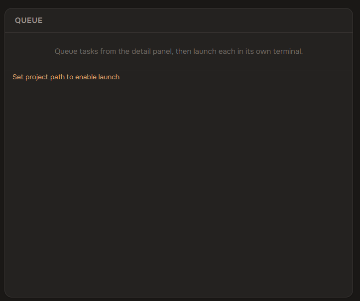

# Dev Manager

Browser-based task manager for [Claude Code](https://docs.anthropic.com/en/docs/claude-code). Create tasks, queue work — Claude Code picks them up and gets it done.

## Quick Start

**Prerequisites:** [Node.js](https://nodejs.org/) 18+, [Claude Code](https://docs.anthropic.com/en/docs/claude-code), Chrome or Edge

```bash
git clone https://github.com/vsokh/dev-manager.git && cd dev-manager && npm install
```

```bash
npm run dev
```

Open the URL from your terminal in **Chrome or Edge**.

## Usage

1. **Open project** — pick the folder of the project you want to manage (not this repo, your own project). Grant read/write access when prompted.

2. **Create tasks** — add work items on the left, write instructions in the detail panel on the right.

3. **Queue & launch** — queue a task, then hit the play button to open Claude Code with that task loaded.

The orchestrator reads your task, plans the approach, asks for your approval, delegates to sub-agents, and writes results back. Dev Manager picks up changes automatically.

## One-Click Launch Setup (one-time)

The play buttons need a `claudecode://` protocol registered on your machine.

**Windows:** `install-protocol.cmd`
**Linux:** `chmod +x install-protocol.sh && ./install-protocol.sh`

Then set your project path in the queue panel:



## How It Works

```
  You (Browser)              Orchestrator (Claude Code)          Sub-agents
       |                              |                              |
  Create tasks                        |                              |
  Write notes ─── state.json ───►     |                              |
  Queue work                          |                              |
       |                              |                              |
       |          ▶ Launch via play button                          |
       |                              |                              |
       |                     Read queue + notes                      |
       |                     Plan approach ──► you approve           |
       |                     Delegate ──────────────────────────►  work
       |                     Review  ◄──────────────────────────   done
       |                     Write back ──► state.json               |
       |                              |                              |
  See results ◄── auto-sync           |                              |
```

## License

MIT
