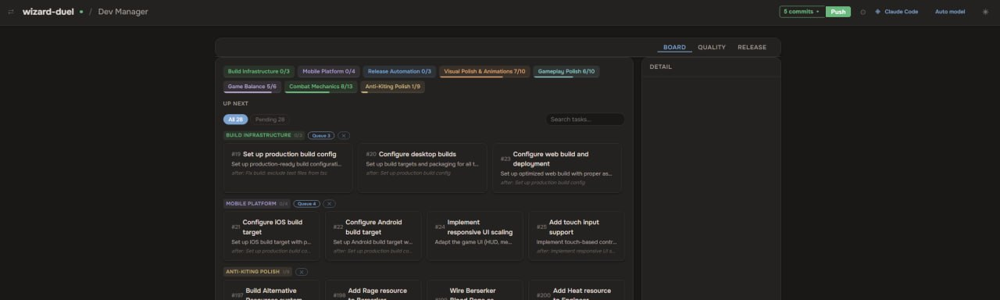
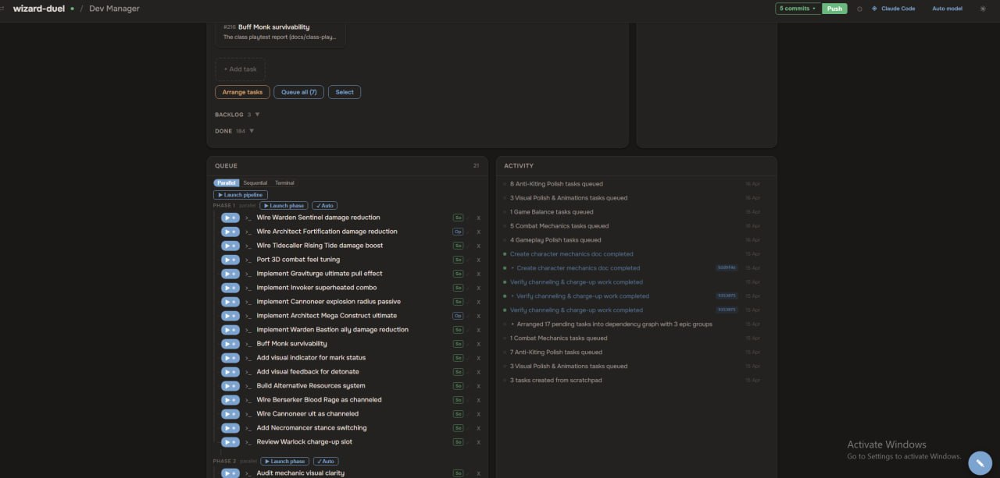
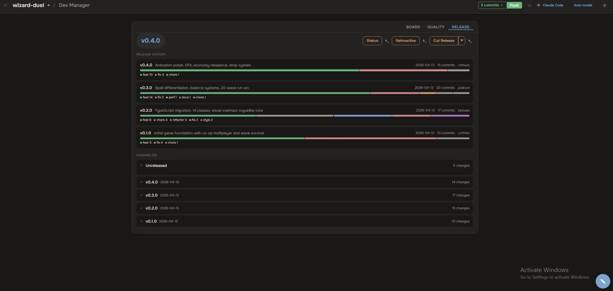

# Dev Manager

**A kanban board for running a team of AI coding agents.**

You're the manager: split work into tasks, write the instructions, and queue them. An orchestrator ([Claude Code](https://docs.anthropic.com/en/docs/claude-code)) plans the approach and delegates each task to a sub-agent in its own git worktree. Results sync back to the board live.



## Quick Start

Needs [Node.js](https://nodejs.org/) 18+ and [Claude Code](https://docs.anthropic.com/en/docs/claude-code).

```bash
git clone https://github.com/vsokh/maestro.git && cd maestro && npm install && npm run build
npm start ./your-project   # point it at your project, opens http://localhost:4545
```

## How it works

1. **Create tasks** on the board — group into epics, set dependencies, write instructions.
2. **Queue & launch** — hit play to run Claude Code in a terminal tab or headless; tasks run in parallel or sequential phases.
3. **Approve the plan** — the orchestrator proposes an approach before touching code.
4. **Watch it land** — sub-agents work in isolated worktrees; the board and activity feed update live over WebSocket.



## Features

- **Task board** — statuses, epics, dependencies, attachments
- **Scratchpad** — paste raw ideas, split into tasks with one click
- **Command queue** — one-click launch into Claude Code, terminal or headless with live output
- **Quality panel** — code health across 11 dimensions, with trends and a radar chart
- **Release management** — version history, commits by type, auto-generated changelog
- **Activity feed**, **multi-project support**, and **git integration** (push from the UI)



## Architecture

Vite + React 19 + TypeScript frontend; a Node.js bridge server (HTTP + WebSocket + file watcher). Everything flows through one state file — `.maestro/state.json` — that both the UI and the agents read and write. The server watches it and pushes changes to the browser; agents write progress files that get merged back in.

```
  You (Dev Manager)            Orchestrator (Claude Code)          Sub-agents
  Create tasks ─── state.json ──►  Read queue + notes
  Queue & launch ─────────────►    Plan ──► you approve
                                   Delegate ──────────────────►  work in worktrees
  See results ◄── WebSocket ───    Write back ◄───────────────   done
```

## License

MIT
